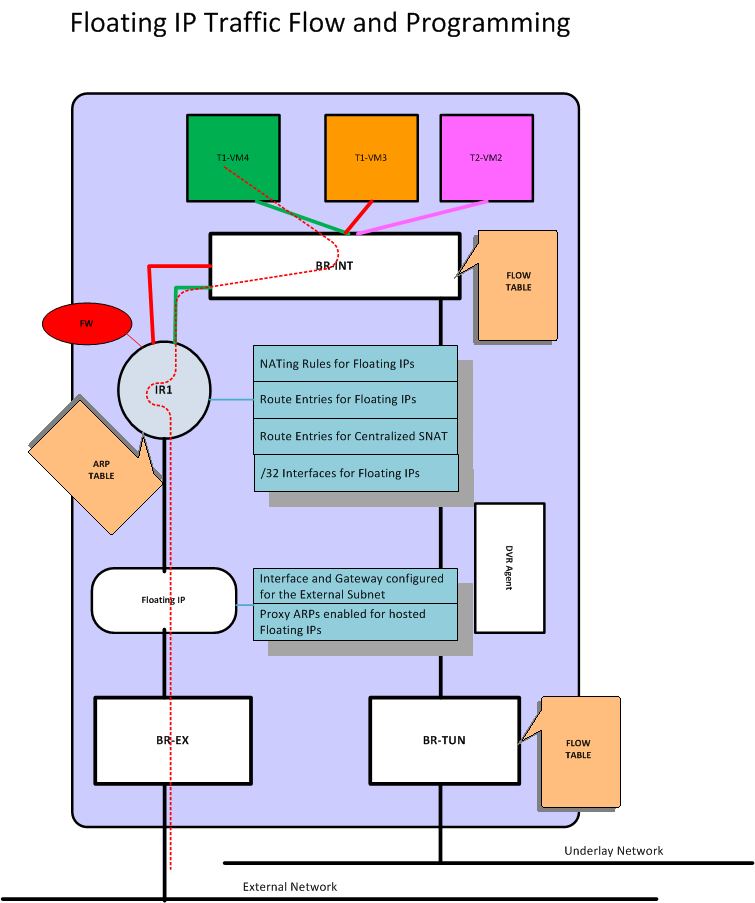

## 计算节点
需要额外启用 l3_agent（dvr 模式），以及 metadata agent。

其实，跟传统情况下的网络节点十分类似。每个路由器有自己的命名空间，进行跨子网的转发。

所不同的是，单独有一个 qfloat-XXX 路由器（也在一个独立命名空间中）来负责处理带有 floating IP 的南北向流量。

这里面比较重要的地方，是可能有多个同样的网关存在于多个计算节点上，因为同一个子网的虚机是可能存在在多个计算节点的。

要解决这个问题，也不难，合理处理好本地的 ARP 请求，让本地对网关的请求拦截发给本地的路由器即可。
